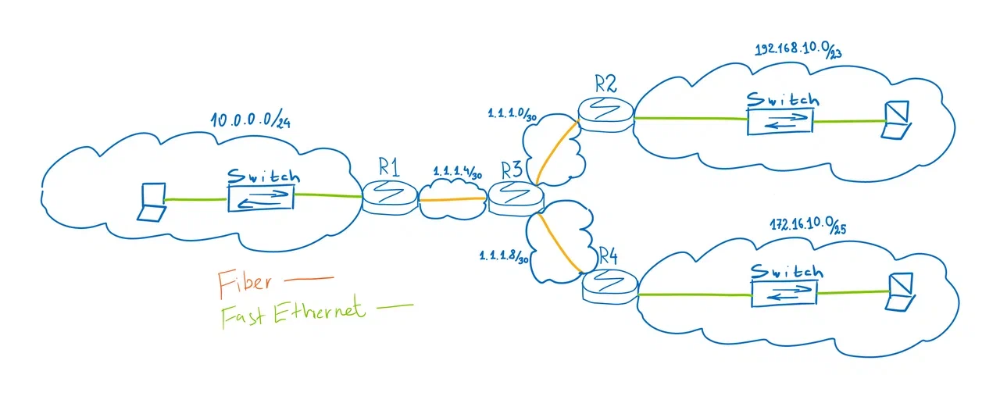
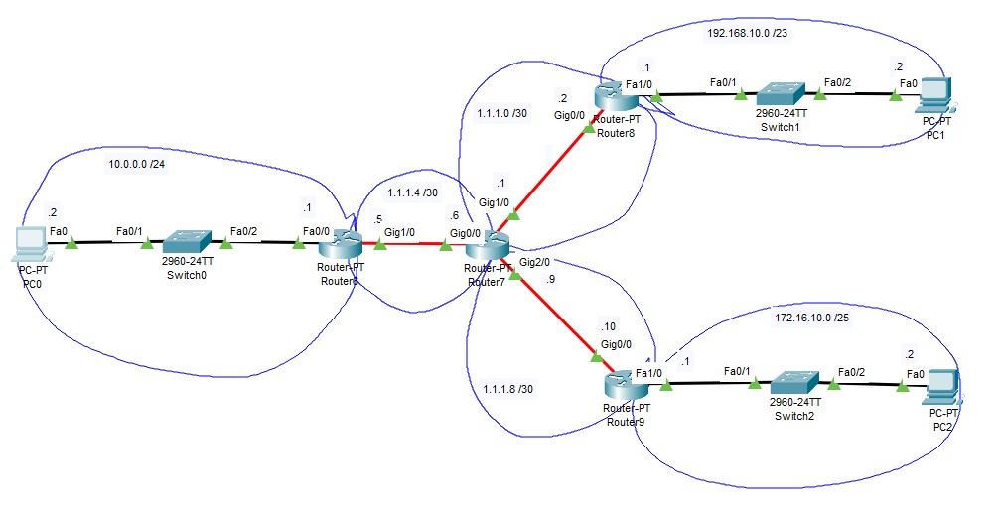
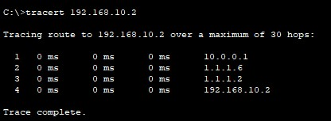

Посмотрите скринкаст как работать с маршрутизацией перед вторым семинаром к уроку про протокол IP: https://disk.yandex.ru/i/0gPQF3I-20RWdQ
команды для Cisco IOS - https://disk.yandex.ru/d/PwxEU3KrArG8Zw

Задание 1:
Собрать сеть по схеме ниже.
(https://disk.yandex.ru/i/OLDO0-t_pURhVA - рисунок схемы)

Необходимо связать только сети 192.168.10.0/23, 10.0.0.0/24 и 172.16.10.0/25 между собой, чтобы компы пинговали друг друга.Показать успешный пинг.
Выберете роутеры, чтобы можно было добавлять SPF модули в R2, R3, R4. Соедините оптикой, как на схеме.
Поднимите интерфейсы и настройте IP адреса.
Пропингуйте соседние устройства.
Пропишите маршруты.

Задание 2:
Убедитесь, что из сетей 192.168.10.0/23, 10.0.0.0/24 и 172.16.10.0/25 нет пинга до сетей 1.1.1.Х  
(только к тем, которые не является Connected к ближайшим роутерам). Усложните схему связности, сделав так, чтобы эти сети были доступны.

# Solution:

 

