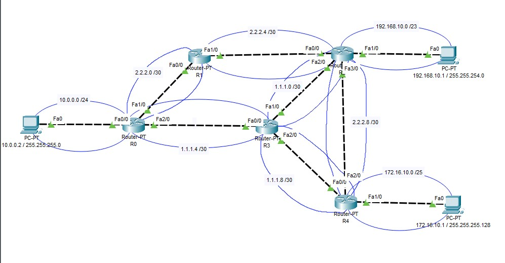
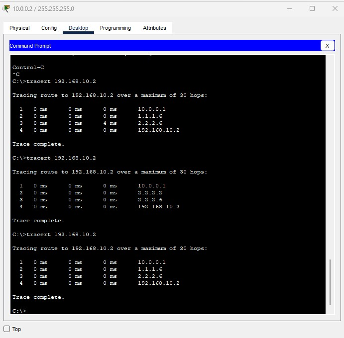

# Task №4

Задачи к семинару

1. Дайте задание студентам самим собрать сеть по схеме ниже https://disk.yandex.ru/i/cVwW4dy36JvZrQ
   Посмотреть как отрабатываем ЕСМР между сетями 10.0.0.0/24 и 192.168.10.0/23
   Запустить бесконечный пинг с компа из сети 10.0.0.0/24 на комп 192.168.10.0/23 ( ping -t X.X.X.X ).  
   Перевести любой линк между роутерами в shutdown. Посмотреть на сколько пинг прервался. Вывести tracert.
2. Дайте задание студентам самим собрать сеть по схеме ниже. Компы из этих сетей должны пинговать друг друга через  
   роутер.  https://disk.yandex.ru/i/1--oa-XKmCsWBQ

# Solution

1. Поднял сеть, прописал айпишники, настроил OSPF на всех роутерах, запустил tracert, и бесконечный пинг в режиме  
   симуляции: [Classwork_4.pkt](Classwork_4.pkt)  

 

 

2. 